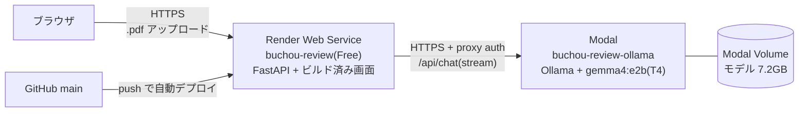

# 部長レビュー(ai-docs-review)

提出前の資料(**.pptx / .pdf**)を、**多忙な部長の視点**で 1 ページずつ採点する Web アプリ。
LLM は Ollama(`gemma4:e2b`、vision 対応)を使う。本番は Modal の GPU、開発時はローカルや Colab でも動く。

- **ページ別の採点**: 各ページに 6 基準のスコアと「良い点・悪い点・修正点」
  | 基準 | 採点者 | 方法 |
  |---|---|---|
  | 内容 | LLM | ページ画像 + テキスト + 資料全体の構成から判断 |
  | 図 / グラフ | LLM | ページ画像を見て判断。無いページは対象外(–) |
  | フォントサイズ | 計測 | 14pt 未満の文字の割合(PDF の実寸) |
  | フォント | 計測 | ページ内の書体ファミリー数(pptx は元ファイルの書体) |
  | 文字量 | 計測 | ページの文字数(150字以下が満点) |
- **機械チェック**: 表記ゆれ・半角カナ・長文・表紙タイトルを LLM なしで即時判定
- **会社ルール(基準パック)**: 会社ごとの禁止表現・表記の統一・必須記載事項を YAML で定義し、根拠の条文付きで決定的に判定。must の違反があれば「会社ルールの必須項目に違反があります」(下記「基準パック」)
- **総合判定**: 全ページ平均 70 点以上で合格。機械チェックもゼロなら「提出OK」
- **Markdown ダウンロード**: 採点結果(修正点のチェック状態つき)を `.md` で保存
- pptx は LibreOffice で PDF 化し、ページ画像・文字サイズは PDF から、テキスト・書体は pptx から読む

## 現状の構成

### 本番構成(2026-09 時点)



| 構成要素 | 置き場所 | 役割 | 費用・停止 |
|---|---|---|---|
| 画面 + API | Render(Python ランタイム、Docker なし)。定義は `render.yaml` / `bin/render-build.sh` | アップロード受付、PDF の解析と計測、機械チェック、LLM 呼び出し、結果のストリーミング、画面の配信 | Free。無操作 15 分でスリープし、次のアクセスで約 1 分かけて起動 |
| LLM(Ollama) | Modal(T4 GPU × 最大 1 台)。定義は `deploy/modal_ollama.py` | ページ画像とテキストから内容・図・グラフを採点し、良い点・悪い点・修正点を返す | 動いている間だけ課金(T4 は約 $0.59/時、Starter の無料枠は $30/月)。最後のリクエストから 5 分で停止 |
| モデル | Modal Volume `buchou-review-ollama-models` | gemma4:e2b(7.2GB)を保存し、起動のたびにダウンロードしないようにする | 保存のみ |
| ソース・CI | GitHub(`main`)と GitHub Actions | lint / typecheck / test(カバレッジ 80%)。main への push で Render が再デプロイ | 無料 |

### 採点 1 回の流れ

1. ブラウザが `GET /api/health` を呼び、Render が Modal の `/api/tags` に問い合わせる。Modal が停止中なら、ここで GPU コンテナが起動する(約 80〜100 秒)
2. ブラウザが PDF を `POST /api/review` で送る。上限を超える本文は、解析前にミドルウェアで打ち切る(413)
3. Render が PDF を読み、ページごとに文字サイズ・書体・文字数を計測して画像(JPEG)にする。機械チェック(表記ゆれ等)も行う
4. `meta` イベント(ページ数・機械チェック)を先に返し、1 ページずつ Modal に画像 + テキストを送って採点する
5. ページごとに `page` イベントを返す(起動後は 1 ページ 7〜9 秒、起動直後の 1 ページ目は約 1 分)
6. 最後に `done` イベント(基準別平均・総合判定)を返す。画面は受け取った順に表示し、Markdown でダウンロードできる

### 秘密情報の置き場所

URL と認証情報は**リポジトリに書かない**(公開リポジトリのため)。

| 値 | ローカル | Render |
|---|---|---|
| `REVIEW_OLLAMA_URL`(Modal の URL) | `.env`(git 管理外) | ダッシュボードの Environment(`render.yaml` では `sync: false`) |
| `REVIEW_OLLAMA_HEADERS`(Modal の Proxy Auth Token) | `.env` | 同上 |
| Modal のアカウント認証 | `~/.modal.toml`(`uvx modal token new`) | 不要 |

### 運用

| やりたいこと | 方法 |
|---|---|
| アプリを更新する | PR を main にマージする → Render が自動で再デプロイ(約 1 分) |
| デプロイの成否を見る | GitHub の Deployments、または Render ダッシュボードの Events |
| Modal 側(Ollama)を更新する | `make modal-deploy`(モデルを変えるときは先に `make modal-pull`) |
| Modal が動いているか見る | `uvx modal container list` / `uvx modal app logs buchou-review-ollama` |
| Proxy Auth Token を作り直す | Modal ダッシュボードで作成し、`.env` と Render の `REVIEW_OLLAMA_HEADERS` を書き換える |
| ローカルで開発する | `make dev`(`.env` の設定で Modal などに接続) |

### 既知の制約

- **Render では PDF のみ採点できる**。Python ランタイムに LibreOffice が無いため、pptx は画面で「PDF に書き出してから」と案内する。
  pptx を扱うのはローカル(`make dev`)か、同梱の `Dockerfile` を使う構成(未ビルド検証)
- **アクセス制限が無い**。Render の URL を知っていれば誰でもアップロードでき、Modal の GPU 時間を消費する
- **待ち時間**: Render と Modal がどちらも停止していると、最初の採点が始まるまで最大 2〜3 分かかる
- **同時利用**: GPU は 1 台なので、同時に採点すると順番待ちになる
- 開発用の代替として Google Colab + Cloudflare Quick Tunnel も使える(後述)。URL が起動のたびに変わり、Colab の利用規約にも注意が必要

### 設計で判断したこと

- **LLM に計測をさせない**: フォントサイズ・書体・文字量は PDF から数える(毎回同じ・説明可能)。小型モデルには判断が要る内容・図・グラフだけを任せる
- **PDF に統一**: pptx も PDF にしてから画像と計測値を取る。LibreOffice の PDF は日本語テキストが化けることがあるため、pptx のテキストと書体は元ファイルから読む。
  日本語テーマの書体設定(空の `a:ea`)が原因の文字化けは、変換前に補正している(`infra/pptx_fix.py`)
- **pdfplumber(MIT)を採用**: PyMuPDF は AGPL のため、公開ホスティングでは避けた
- **応答はストリーミング**: 画面にはページごとに結果を流し(NDJSON)、Ollama からも `stream: true` で受け取る。
  Cloudflare(524)は 1 回だけ再試行する
- **GPU を無駄に起こさない**: Render のヘルスチェックは Ollama を呼ばない `/api/live` を使う

## 基準パック(会社ルール)

会社のガイドラインを YAML で書き、`REVIEW_STANDARD_PATH` にそのパスを渡すと、機械チェックに「会社ルール」の指摘が加わる。
判定は文字列・正規表現の照合だけで行う(LLM を使わない)ので、同じ資料なら毎回同じ結果になる。照合では空白・改行を無視する。

```yaml
name: サンプル基準(介護向け提案書)
version: "1.0"
rules:
  - id: R-EXPR-01
    kind: forbid            # forbid: 禁止表現 / prefer: 表記の統一(use が推奨表記)/ required: 資料のどこかに必須
    patterns: [必ず, 絶対, 100%, 確実に]
    severity: must          # must: 違反があれば不合格(formal_passed=false)/ should: 推奨
    source: 提案書作成ガイドライン §4.2 効果の言い切りの禁止
    message: 効果を言い切らない
```

- サンプル(どちらも架空): `backend/tests/fixtures/packs/sample_care_sales.yaml`(介護向け提案書・10 ルール)、
  `backend/tests/fixtures/packs/sample_manufacturing.yaml`(製造業の稟議・品質報告・改善提案・14 ルール + LLM への観点 9 件)
- **LLM への会社の観点**(`review_guidelines`、任意): 内容・図・グラフの観点ごとに、部長(LLM)に確かめさせたい会社の指示を書く。
  システムプロンプトに差し込まれ、採点と指摘(悪い点・修正点)に反映される。LLM の判断なので結果は参考扱いで、合否(formal_passed)には使わない。
  小型モデルでも守れるよう、各観点5件・1件200字まで

  ```yaml
  review_guidelines:
    content: [代替案と比較し、この案を選んだ理由を書いている]
    figure:  [図の中の文字や数値が読める大きさになっている]
    chart:   [軸の単位と、データの出典・期間が書いてある]
  ```

- 正規表現(`regex: true`)はパックの管理者が書く前提。`(a+)+` のような入れ子の量指定は、処理が極端に遅くなるので使わない
- **顧客のパックはリポジトリに置かない**。Render では Secret File にして、そのパスを `REVIEW_STANDARD_PATH` に設定する
- 使っているパックは `GET /api/standard` と画面・Markdown の「基準」に表示される

### 違反を仕込んだサンプル資料(比較実験・デモ用)

```bash
make sample-deck   # samples/violation-deck.pptx・.pdf(架空の提案書 9 ページ、違反 20 件)と answer-key.md
```

サンプルのパックで採点すると、正解表の 20 件がちょうど検出される(pptx 経路・PDF 経路とも。テストで保証)。
Copilot など他のツールに同じ資料をかけ、検出率・再現性・根拠の有無を比べるのに使う。

## 必要なツール

- [uv](https://docs.astral.sh/uv/)、[pnpm](https://pnpm.io/) + Node.js 22+(`corepack enable pnpm`)
- [LibreOffice](https://www.libreoffice.org/)(pptx の PDF 変換。macOS: `brew install --cask libreoffice`)
- LLM の実行環境: [Modal](https://modal.com/) のアカウント(本番。下記「Modal で Ollama を動かす」)、またはローカルの [Ollama](https://ollama.com/) + `gemma4:e2b`
- 開発ワークフロー用: [gh](https://cli.github.com/)、Claude Code

## ローカルで起動

```bash
make dev     # backend(:8000)+ 画面(:5173)を同時起動。依存が無ければ make setup も自動実行
make serve   # frontend をビルドして :8000 の 1 プロセスで配信(Render と同じ構成)
```

どちらも Ctrl+C で全サーバが止まる。接続先などの設定はリポジトリ直下の `.env` に書く
(`cp .env.example .env` して `REVIEW_OLLAMA_URL` と `REVIEW_OLLAMA_HEADERS` を入れる)。`.env` は git 管理外。
未設定なら `http://localhost:11434`。コマンド実行時の環境変数が `.env` より優先される。
ポートは `BACKEND_PORT` / `FRONTEND_PORT` で変更できる。

> URL や認証情報は公開リポジトリにコミットしない。

## Modal で Ollama を動かす(推奨)

`deploy/modal_ollama.py` が Ollama + gemma4:e2b を Modal の T4 GPU で公開する。URL は固定、
使われていない間は自動停止(最後のリクエストから 5 分)するので、Starter の無料枠($30/月、T4 で約 50 時間)に収まりやすい。

```bash
uvx modal token new     # 初回のみ: Modal にログイン(ブラウザが開く)
make modal-pull         # 初回のみ: モデル(7.2GB)を Modal の Volume に保存(GPU 不使用)
make modal-deploy       # 公開。https://<workspace>--buchou-review-ollama-ollama.modal.run が表示される
```

エンドポイントは **proxy auth** 付き(認証なしは 401)。Modal ダッシュボードの Settings → Proxy Auth Tokens で
トークンを作り、アプリに次の 2 つを設定する(ローカルは `.env`、Render はダッシュボード。どちらもリポジトリに書かない)。

```
REVIEW_OLLAMA_URL=https://<workspace>--buchou-review-ollama-ollama.modal.run
REVIEW_OLLAMA_HEADERS={"Modal-Key": "wk-...", "Modal-Secret": "ws-..."}
```

- 実測: 停止状態からの起動(コールドスタート)約 80 秒、起動後は 1 ページ 7〜9 秒
- 停止中に画面を開くと、接続ランプは起動が終わるまで「確認中」のまま(最大 `REVIEW_HEALTH_TIMEOUT_SECONDS`)
- Render のヘルスチェックは Ollama を呼ばない `/api/live` を使う(GPU を定期的に起こさないため)

## Google Colab の Ollama を使う(開発用の代替)

Colab(**GPU ランタイム**)で Ollama を起動し、Cloudflare Quick Tunnel で公開する。セルを上から順に実行する。

```python
# 1) Ollama を入れて起動する
!curl -fsSL https://ollama.com/install.sh | sh
import subprocess, os
env = {
    **os.environ,
    "OLLAMA_HOST": "0.0.0.0:11434",   # 必須: 127.0.0.1 待ち受けだとトンネル経由は Host 検査で 403
    "OLLAMA_ORIGINS": "*",
    "OLLAMA_CONTEXT_LENGTH": "8192",  # アプリの REVIEW_NUM_CTX と揃える(違うと初回にモデルを読み直す)
    "OLLAMA_KEEP_ALIVE": "-1",        # モデルをメモリに置いたままにする(既定は 5 分で解放)
}
subprocess.Popen(["ollama", "serve"], env=env, stdout=open("ollama.log", "w"), stderr=subprocess.STDOUT)
!sleep 5 && ollama pull gemma4:e2b
```

```python
# 2) 暖機: モデルを読み込んでおく(Colab 起動直後の初回は読み込みで 100 秒を超え、Cloudflare が 524 を返すことがある)
!curl -s localhost:11434/api/chat -d '{"model":"gemma4:e2b","stream":false,"options":{"num_ctx":8192},"messages":[{"role":"user","content":"ok"}]}' > /dev/null && echo warmed
```

```python
# 3) トンネルを張って URL を表示する
!wget -q https://github.com/cloudflare/cloudflared/releases/latest/download/cloudflared-linux-amd64 -O cloudflared && chmod +x cloudflared
!nohup ./cloudflared tunnel --url http://localhost:11434 > cloudflared.log 2>&1 &
!sleep 8 && grep -o 'https://[a-z0-9-]*\.trycloudflare\.com' cloudflared.log | head -1
```

表示された URL を、Render のダッシュボード(またはローカルの `.env`)の `REVIEW_OLLAMA_URL` に設定する。
Quick Tunnel の URL は起動のたびに変わる。アプリ側も 524 は 1 回だけ自動で再試行するが、暖機しておくと確実。

## Render でホスティング(Docker なし)

1. このリポジトリを Render に接続し、**New → Blueprint** で `render.yaml` から作成する
   - Python ネイティブランタイム。ビルドは `bin/render-build.sh`(uv で backend、Node を用意して frontend をビルド)
   - 起動は `cd backend && .venv/bin/uvicorn app.main:app --host 0.0.0.0 --port $PORT`(画面と API を同一オリジンで配信)
2. ダッシュボードで `REVIEW_OLLAMA_URL`(Modal の URL、または Colab のトンネル URL)と、Modal なら
   `REVIEW_OLLAMA_HEADERS` を入力する(`sync: false`。公開リポジトリに載せない)
3. プランは Free で動く(無操作 15 分でスリープし、次のアクセスで起動に 1 分程度かかる)

> **Render 上では PDF のみ採点できる。** Python ランタイムには LibreOffice を入れられないため、pptx は
> 画面で「PowerPoint で PDF に書き出してからアップロード」と案内する(対応形式は `GET /api/capabilities`)。
> pptx も採点したい場合は、同梱の `Dockerfile`(LibreOffice 入り)で Docker ランタイムを使う。

> **公開時の注意**: Render の URL を知っていれば誰でもアップロードでき、Modal の GPU 時間を消費する。
> アップロードした資料は Render と Modal(Colab を使う場合は Colab と Cloudflare)に送られる。
> 社外秘の資料を扱う場合は、アクセス制限(Render の IP 制限や前段の認証)を検討すること。

## 設定(環境変数)

| 変数 | 既定値 | 用途 |
|---|---|---|
| `REVIEW_OLLAMA_URL` | `http://localhost:11434` | Ollama の URL(Modal の URL など) |
| `REVIEW_OLLAMA_HEADERS` | `{}` | Ollama に付けるヘッダー(JSON)。Modal の proxy auth に使う |
| `REVIEW_HEALTH_TIMEOUT_SECONDS` | `120` | 接続確認の待ち時間(Modal のコールドスタートを待てる長さ) |
| `REVIEW_MODEL` | `gemma4:e2b` | 使用モデル(vision 対応が必要) |
| `REVIEW_THINK` | 未設定(モデル既定) | `false` で思考を止めて速くする |
| `REVIEW_TEMPERATURE` / `REVIEW_NUM_CTX` | `0.2` / `8192` | 推論パラメータ |
| `REVIEW_TIMEOUT_SECONDS` | `600` | 1 ページあたりの LLM タイムアウト |
| `REVIEW_MAX_PAGES` | `40` | 採点する最大ページ数 |
| `REVIEW_MAX_UPLOAD_MB` | `50` | アップロード上限 |
| `REVIEW_IMAGE_WIDTH` | `1024` | LLM に渡すページ画像の幅(px) |
| `REVIEW_SOFFICE_PATH` | 自動検出 | LibreOffice `soffice` のパス |
| `REVIEW_STANDARD_PATH` | 未設定 | 基準パック(YAML)のパス。未設定なら会社ルールのチェックはしない |
| `REVIEW_STATIC_DIR` | 未設定 | ビルド済み frontend の配信元(render.yaml・Dockerfile で設定済み) |

## API

- `GET /api/live` — `{status: "ok"}`(生存確認。Ollama を呼ばない。Render のヘルスチェック用)
- `GET /api/health` — `{ok, model, model_ready, error}`(Ollama の接続確認)
- `GET /api/standard` — `{name, version, rules}`(基準パックが無ければ `null`。ルール本文は返さない)
- `GET /api/capabilities` — `{formats: ["pdf", "pptx"]}`(LibreOffice が無ければ `["pdf"]`)
- `POST /api/review`(multipart `file`、.pptx / .pdf のみ)— NDJSON で
  `meta`(ページ数・機械チェック)→ `page` / `page_error`(1 ページずつ)→ `done`(基準別平均・判定)

## 開発の回し方

### 自律レーン(issue 駆動)

```
/ticket                      # 会話で意図を引き出し、GitHub issue を作成
/implement backend 42        # issue #42 を plan → TDD → 自己レビュー → PR まで自律実行
```

### 対話レーン(人間と並走)

```
/workon backend              # 環境確認・ブランチ作成・コンテキスト確立
...(対話しながら開発)...
/ship 42                     # 回顧plan生成 → 自己レビュー → PR(issue# は省略可)
```

### レビュー

```
/review 123                  # PR #123 を plan・ticket と突き合わせてレビュー
```

### 補助スキル

| スキル | 用途 | 原典 |
|---|---|---|
| `/debug` | 修正前の根本原因調査(4フェーズ)+ 回帰テスト強制 | obra/superpowers |
| `/verify` | 完了主張前の証拠ゲート(コマンド実行 → 出力確認 → 主張) | obra/superpowers |
| `/e2e` | Playwright でフルスタック検証・スクリーンショット | anthropics/skills |
| `/frontend-design` | 没個性UIを避ける設計プロセス | anthropics/skills |
| `/skill-creator` | スキル追加・改修の作法 | anthropics/skills |

## TDD の強制(4層)

1. **CLAUDE.md 規約** — 失敗テストのコミットが実装コミットに先行すること
2. **implement skill** — Red(失敗確認 → コミット)→ Green → Refactor を手順として強制
3. **CI** — カバレッジ 80% 未満で fail
4. **code-reviewer** — テストコミットの先行を git log で検証。違反は Blocking

## ディレクトリ

```
backend/src/app/
  domain/   pages(ページ・pptx テキスト重ね合わせ)/ metrics(計測で採点する3基準)
            review(6基準・LLM スキーマ・集計)/ reviewer(部長の定義・ページ用プロンプト)
            precheck(機械チェック)/ standard(基準パック・会社ルールの判定)/ service(meta→page…→done のイベント生成)
  infra/    document(形式判定・読み込み)/ converter(LibreOffice)/ pptx_fix(日本語書体の補正)
            standards(基準パックの読み込み)/ pdf_reader / pptx_reader / ollama(stream + 画像 + ヘッダー)/ settings
  api/      routes(/api/live, /api/health, /api/capabilities, /api/review)/ limits(アップロード上限)
frontend/src/
  logic/    events / ndjson / state(reducer)/ labels / markdown / files / escape  ← vitest
  ui/       DOM 描画・イベント結線(テスト免除)
deploy/modal_ollama.py   Modal で Ollama を動かす GPU サーバ
render.yaml, bin/render-build.sh   Render 用(Docker なし)/ Dockerfile は任意の Docker 構成
bin/dev.sh  ローカル起動(make dev / make serve)
plans/      plan・workflow_state・findings
```
